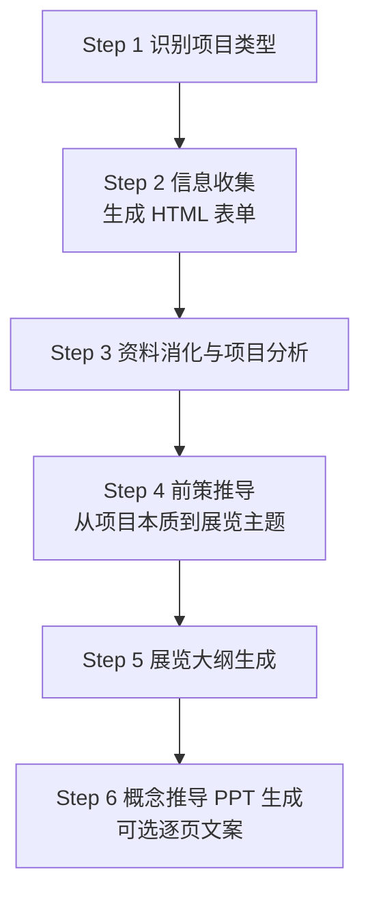

# 🧭 KK 策展助手

[English](README_en.md) | 简体中文

> 一个面向展览前策的 Claude Code Skill，把零散的甲方资料、空间条件与受众目标，推导为可复制、可讨论、可继续深化的展览大纲。

[](LICENSE)


## 🎯 这是什么

KK 策展助手像一套“展览前策导航仪”：当策展人面对大量甲方资料、空间条件、受众诉求和内容素材时，它不会直接跳到创意口号，而是按固定流程先识别项目类型、收集信息、分析项目本质，再推导主题、组织叙事线路，最后输出标准化展览大纲。

它解决的是展览策划中最容易失控的一段工作：从“资料很多、方向很散”到“主题明确、结构清楚、可以进入设计深化”。适合策展人、展陈设计师、文博从业者、文旅策划人员，以及需要把展厅需求整理成前策大纲的团队使用。

## ✨ 核心特性

| 特性 | 说明 |
| --- | --- |
| 6 步结构化策展流程 | 从项目类型识别推进到信息收集、项目分析、前策推导、展览大纲与可选概念推导 PPT 文案。 |
| 三类项目分别指导 | 覆盖企业展厅、博物馆/文化馆、文旅/主题展馆，每类都有独立信息清单、分析框架和大纲要点。 |
| 五种叙事线路方法论 | 支持金字塔式、梯式、平行式、散点式、立体式五类故事线判断。 |
| HTML 信息收集表单 | 通过本地 Python 脚本生成 `brief-form.html`，便于把项目信息收集为可回传文本。 |
| 三种概念推导 PPT 范式 | 提供受众驱动型、概念类比型、破局立意型三种逐页文案骨架。 |

## 🧩 工作流程



| 步骤 | 产出 | 说明 |
| --- | --- | --- |
| Step 1 | 项目类型 | 判断项目属于 A 企业展厅、B 博物馆/文化馆、C 文旅/主题展馆。 |
| Step 2 | 信息收集表 | 运行脚本生成 HTML 表单，让用户填写项目资料并回传。 |
| Step 3 | 项目分析摘要 | 梳理委托方背景、展示对象、核心诉求、空间约束和独特价值点。 |
| Step 4 | 主题推导 | 找本质张力、选叙事线路、写主题情绪句、确定主题词和主题释义。 |
| Step 5 | 展览大纲 | 按标准框架输出树形结构和可复制 Markdown 表格。 |
| Step 6 | PPT 逐页文案 | 可选生成概念推导 PPT 的页面标题、正文要点和视觉提示。 |

## 🚀 安装

Claude Code 支持把个人 Skill 放在 `~/.claude/skills/`，也可以把团队项目 Skill 放在项目内的 `.claude/skills/`。本仓库本身就是一个 Skill 文件夹，安装后目录中应能看到 `SKILL.md`。

### macOS / Linux

```bash
git clone https://github.com/sunzhaokai95/kk-exhibition-planner-skill.git
mkdir -p ~/.claude/skills
cp -R kk-exhibition-planner-skill ~/.claude/skills/
```

安装完成后的关键路径：

```text
~/.claude/skills/kk-exhibition-planner-skill/SKILL.md
```

### Windows PowerShell

```powershell
git clone https://github.com/sunzhaokai95/kk-exhibition-planner-skill.git
New-Item -ItemType Directory -Force "$env:USERPROFILE\.claude\skills"
Copy-Item -Recurse -Force ".\kk-exhibition-planner-skill" "$env:USERPROFILE\.claude\skills\"
```

安装完成后的关键路径：

```text
%USERPROFILE%\.claude\skills\kk-exhibition-planner-skill\SKILL.md
```

### 作为项目子模块使用

如果你希望某个团队项目固定使用同一版本，可以把它作为 git submodule 放进项目级 skills 目录：

```bash
mkdir -p .claude/skills
git submodule add https://github.com/sunzhaokai95/kk-exhibition-planner-skill.git .claude/skills/kk-exhibition-planner-skill
git commit -m "Add KK exhibition planner skill"
```

## 💬 使用方法

触发 Skill 后，助手会先原样输出固定开场白：

```text
你好，我是策展人孙兆楷的分身小助理 KK。
```

随后它会说明 6 步流程，并按步骤推进。流程不会跳步：先判断项目类型，再生成信息收集表，等用户填写资料后才进入分析与主题推导。

简短示例：

```text
用户：我想做一个文旅主题展馆策划，帮我从前策开始梳理。

KK：你好，我是策展人孙兆楷的分身小助理 KK。

接下来我会按以下流程推进：
Step 1 识别项目类型
Step 2 信息收集（生成 HTML 表单）
Step 3 资料消化与项目分析
Step 4 前策推导 → 展览主题
Step 5 展览大纲生成
Step 6 概念推导 PPT 生成（可选）

请先确认项目属于以下哪类：A 企业展厅、B 博物馆/文化馆、C 文旅/主题展馆。
```

## 🏛️ 三类项目与适用场景

| 项目类型 | 典型场景 | 核心策划起点 |
| --- | --- | --- |
| A 企业展厅 | 品牌馆、产品展示中心、销售体验厅、园区展厅 | 回到企业本质、品牌价值、受众转化目标与行业角色。 |
| B 博物馆/文化馆 | 历史博物馆、纪念馆、非遗馆、校史馆、档案馆、科技馆 | 把学术内容故事化，先建立完整内容体系，再转化为可参观的叙事结构。 |
| C 文旅/主题展馆 | 城市展示馆、规划馆、景区展厅、沉浸式主题馆、IP 主题展 | 从运营、传播、体验和资源独特性反推内容组织。 |

## 🧠 叙事线路方法论

| 故事线 | 逻辑结构 | 适用场景 |
| --- | --- | --- |
| 金字塔式 | 1 个核心观点 -> 3 到 5 个论点 -> 各自展开 | 最通用，适合多数项目。 |
| 梯式 | 层层拔高：现实 -> 超脱 -> 理想/未来 | 有强价值观的品牌馆、文化馆、历史叙事或未来愿景类项目。 |
| 平行式 | 多个独立主题板块并列呈现 | 政府馆、规划馆、多产品线企业、综合类内容。 |
| 散点式 | 多场景围绕一个精神内核，形散神聚 | 艺术馆、强 IP 主题展、文旅体验馆。 |
| 立体式 | 多种逻辑嵌套综合使用 | 大型复杂项目，或同时具备时间、空间、专题多重线索的项目。 |

## 🪄 概念推导范式

| 范式 | 适用判断 | 产出特征 |
| --- | --- | --- |
| 受众驱动型 | 多方受众需要被说服，例如企业、政府、招商、园区类项目。 | 先回答“为谁做”，再从受众诉求反推主题，理性稳健。 |
| 概念类比型 | 主题是抽象概念、理念或体验，需要建立记忆点。 | 以普世概念和连续设问抬升主题，感性、有冲击力。 |
| 破局立意型 | 价值传承、纪念、教育、校史、行业精神等项目以立意升华为重点。 | 先否定平庸定位，再建立更高层的精神性价值定位。 |

## 📂 实战案例

以下案例均已脱敏，仅保留策展方法论的应用过程。更多说明见 [examples/README.md](examples/README.md)。

| 案例 | 项目类型 | 叙事线路 | 推导范式 |
| --- | --- | --- | --- |
| [某精准医疗企业展厅](examples/01-enterprise-hall.md) | A 企业展厅 | 梯式 + 立体式 | ① 受众驱动型 |
| [某市城市生态科普馆](examples/02-eco-museum.md) | B 科普馆 | 平行式 | ③ 破局立意型 |

## 📁 项目结构

```text
kk-exhibition-planner-skill/
├── SKILL.md                         # Skill 主流程：固定开场白、6 步工作流、核心原则
├── README.md                        # 中文说明文档
├── README_en.md                     # 英文说明文档
├── CONTRIBUTING.md                  # 贡献指南
├── LICENSE                          # MIT License
├── .gitignore                       # Git 忽略规则
├── examples/
│   ├── README.md                    # 脱敏案例索引
│   ├── 01-enterprise-hall.md        # 企业展厅匿名化流程案例
│   └── 02-eco-museum.md             # 城市生态科普馆匿名化流程案例
├── references/
│   ├── type-a-enterprise.md         # 企业展厅：信息清单、分析框架、推导要点
│   ├── type-b-museum.md             # 博物馆/文化馆：资料结构、故事化方法、大纲要点
│   ├── type-c-cultural-tourism.md   # 文旅/主题馆：运营、传播、体验导向策划指南
│   ├── outline-template.md          # 展览大纲层级定义、表格模板、自检清单
│   └── concept-deck-flows.md        # 三种概念推导 PPT 逐页文案范式
└── scripts/
    └── generate_brief_form.py       # 本地生成 HTML 项目信息收集表
```

## ❓ 常见问题 FAQ

| 问题 | 回答 |
| --- | --- |
| 是否需要联网？ | Skill 本体和 `generate_brief_form.py` 脚本不要求联网。脚本会在本地生成 HTML 表单。若你让助手额外查公开资料，则取决于你的 Claude Code 环境和授权。 |
| 数据隐私如何？ | 表单脚本只在本地生成 `brief-form.html`，不会主动上传数据。你填写并复制回对话的资料，将按你所使用的 Claude Code/模型服务环境处理。 |
| 能否自定义项目类型？ | 可以改造 `references/` 中的方法文件和 `scripts/generate_brief_form.py` 的字段定义。建议新增类型时先明确它与企业、博物馆/文化馆、文旅/主题馆三类的差异。 |
| 它会生成完整展览文本吗？ | 不会。当前 Skill 的边界是展览前策与大纲，止步于主题、结构、内容要点和概念推导 PPT 逐页文案。 |
| 它会直接导出 PPTX 吗？ | 不会。Step 6 输出的是结构化 Markdown 逐页文案，便于后续复制到 PPT 或设计软件中深化。 |

## 🤝 贡献指南

欢迎提交改进建议与 PR。请先阅读 [CONTRIBUTING.md](CONTRIBUTING.md)，尤其注意不要提交真实甲方项目名称、企业名称或未脱敏资料。

## 📄 许可证

本项目基于 [MIT License](LICENSE) 开源。

## 🙏 作者/致谢

作者：**策展人 孙兆楷**

KK 策展助手由策展人孙兆楷的展览前策方法论沉淀而成，旨在让策展推导过程更清晰、更稳定，也更便于团队协作与复盘。
