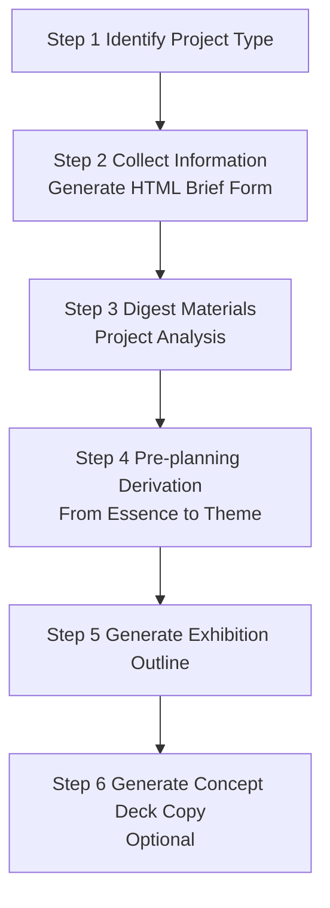

# 🧭 KK Exhibition Planner Skill

English | [简体中文](README_zh.md)

> A Claude Code Skill for exhibition pre-planning. It turns scattered client materials, spatial constraints, and audience goals into a structured exhibition outline that can be discussed, copied, and further developed.

[](LICENSE)


## 🎯 What It Is

KK Exhibition Planner works like a navigation system for exhibition pre-planning. When curators face a pile of client notes, space information, audience requirements, and content fragments, it does not jump straight to a slogan. Instead, it identifies the project type, collects structured information, analyzes the essence of the project, derives a theme, selects a narrative route, and then produces a standard exhibition outline.

It is designed for the messy middle of exhibition planning: moving from “too much material and no clear direction” to “a theme, a structure, and an outline ready for design development.” It is suitable for curators, exhibition designers, museum professionals, cultural tourism planners, and teams that need to organize exhibition requirements into a pre-planning outline.

## 🌱 Why It Exists

I am a curator, which means I often receive a pile of client materials and a deadline that sounds like “we need to see a proposal next week.” Over the years, I realized that the most valuable and hardest-to-teach part of exhibition planning is the concept: deriving what an exhibition is really about from a company, a city, a history, or a cultural resource. This step is often explained as “look more, think more, find the feeling.” KK Exhibition Planner is the lightweight open-source version of the method I have built through years of project work. It does not handle space planning or visual design; it keeps only the most universal and most easily blocked part: from materials, to theme, to exhibition outline. For experienced planners, it is an accelerator. For newcomers, it is a practical mentor that does more than say “find the feeling.”

## ✨ Core Features

| Feature | Description |
| --- | --- |
| 6-step exhibition planning workflow | Moves from project identification to information collection, project analysis, theme derivation, outline generation, and optional concept deck copy. |
| Guidance for three project types | Covers enterprise showrooms, museums/cultural venues, and cultural tourism/theme venues, each with its own checklist and planning logic. |
| Five narrative route methods | Supports pyramid, ladder, parallel, scatter, and multidimensional narrative structures. |
| HTML brief form generation | Uses a local Python script to generate `brief-form.html`, making project information easier to collect and paste back into the assistant. |
| Three concept deck frameworks | Provides audience-driven, concept-analogy, and breakthrough-positioning page flows for concept derivation decks. |

## 🧩 Workflow



| Step | Output | Description |
| --- | --- | --- |
| Step 1 | Project type | Identifies whether the project is A enterprise showroom, B museum/cultural venue, or C cultural tourism/theme venue. |
| Step 2 | Brief form | Runs the script to generate an HTML form for collecting project information. |
| Step 3 | Project analysis summary | Clarifies client background, audience, goals, constraints, and the unique value or core tension. |
| Step 4 | Theme derivation | Finds the core tension, selects a narrative route, writes an internal emotional sentence, and defines the theme. |
| Step 5 | Exhibition outline | Outputs a tree structure and a copy-friendly Markdown table. |
| Step 6 | Concept deck copy | Optionally generates page-by-page concept derivation copy with visual prompts. |

## 🚀 Installation

This repository is already a Skill folder. After installation, the folder should contain `SKILL.md`. Different AI workbenches use different skills directories, so choose the path that matches your environment.

### Claude Code

Claude Code can load personal Skills from `~/.claude/skills/`, and project-level Skills from `.claude/skills/`.

#### macOS / Linux

```bash
git clone https://github.com/sunzhaokai95/kk-exhibition-planner-skill.git
mkdir -p ~/.claude/skills
cp -R kk-exhibition-planner-skill ~/.claude/skills/
```

Expected path:

```text
~/.claude/skills/kk-exhibition-planner-skill/SKILL.md
```

#### Windows PowerShell

```powershell
git clone https://github.com/sunzhaokai95/kk-exhibition-planner-skill.git
New-Item -ItemType Directory -Force "$env:USERPROFILE\.claude\skills"
Copy-Item -Recurse -Force ".\kk-exhibition-planner-skill" "$env:USERPROFILE\.claude\skills\"
```

Expected path:

```text
%USERPROFILE%\.claude\skills\kk-exhibition-planner-skill\SKILL.md
```

### Codex / Work Buddy

If you use Codex, or a Work Buddy setup that supports a local skills directory, copy the repository into `~/.codex/skills/`. If your Work Buddy app uses a custom skills directory, follow the path shown in its settings.

#### macOS / Linux

```bash
git clone https://github.com/sunzhaokai95/kk-exhibition-planner-skill.git
mkdir -p ~/.codex/skills
cp -R kk-exhibition-planner-skill ~/.codex/skills/
```

Expected path:

```text
~/.codex/skills/kk-exhibition-planner-skill/SKILL.md
```

#### Windows PowerShell

```powershell
git clone https://github.com/sunzhaokai95/kk-exhibition-planner-skill.git
New-Item -ItemType Directory -Force "$env:USERPROFILE\.codex\skills"
Copy-Item -Recurse -Force ".\kk-exhibition-planner-skill" "$env:USERPROFILE\.codex\skills\"
```

Expected path:

```text
%USERPROFILE%\.codex\skills\kk-exhibition-planner-skill\SKILL.md
```

### Use as a Git Submodule

For team projects that should pin a shared version, add the Skill as a project-level submodule:

```bash
mkdir -p .claude/skills
git submodule add https://github.com/sunzhaokai95/kk-exhibition-planner-skill.git .claude/skills/kk-exhibition-planner-skill
git commit -m "Add KK exhibition planner skill"
```

## 💬 Usage

When triggered, the Skill explains the six-step workflow and guides the user step by step. It identifies the project type first, generates an information collection form, and only proceeds to analysis and theme derivation after the user provides project materials.

Short example:

```text
User: I want to plan a cultural tourism theme venue. Please help me start from pre-planning.

Assistant: I will proceed with the following workflow:
Step 1 Identify project type
Step 2 Information collection (generate HTML form)
Step 3 Material digestion and project analysis
Step 4 Pre-planning derivation -> exhibition theme
Step 5 Exhibition outline generation
Step 6 Concept derivation PPT generation (optional)

Please confirm the project type first: A enterprise showroom, B museum/cultural venue, or C cultural tourism/theme venue.
```

## 🏛️ Project Types And Use Cases

| Project Type | Typical Scenarios | Core Planning Starting Point |
| --- | --- | --- |
| A Enterprise showroom | Brand hall, product display center, sales experience hall, industrial park showroom | Return to the enterprise essence, brand value, audience conversion goals, and industry role. |
| B Museum/cultural venue | History museum, memorial hall, intangible heritage venue, school history hall, archive, science venue | Transform academic content into a story-driven exhibition structure. |
| C Cultural tourism/theme venue | City exhibition hall, planning hall, scenic-area venue, immersive theme venue, IP theme exhibition | Reverse-plan content from operation, communication, experience, and resource uniqueness. |

## 🧠 Narrative Route Methods

| Route | Logic | Best Fit |
| --- | --- | --- |
| Pyramid | One core point -> 3 to 5 arguments -> detailed expansion | The most universal structure for most projects. |
| Ladder | Step-by-step elevation: reality -> transcendence -> ideal/future | Brand halls, cultural venues, historical narratives, or future-vision projects with strong values. |
| Parallel | Multiple independent thematic sections presented side by side | Government venues, planning halls, multi-product enterprises, and comprehensive content. |
| Scatter | Multiple scenes orbit one spiritual core | Art venues, strong IP theme exhibitions, and cultural tourism experience spaces. |
| Multidimensional | Multiple narrative logics nested together | Large complex projects with time, space, and thematic layers. |

## 🪄 Concept Derivation Frameworks

| Framework | When To Use | Output Character |
| --- | --- | --- |
| Audience-driven | Multiple stakeholders need to be convinced, such as enterprise, government, investment, or park projects. | Starts from “who is this for” and derives the theme from audience needs. Rational and steady. |
| Concept-analogy | The theme is an abstract concept, idea, or experience that needs a strong memory point. | Uses universal analogies and questions to elevate the theme. Emotional and memorable. |
| Breakthrough-positioning | Value inheritance, commemoration, education, school history, or industry spirit is the priority. | Rejects generic positioning first, then builds a higher spiritual value position. |

## 📂 Practical Examples

The following examples are anonymized and retain only the planning methodology in action. See [examples/README.md](examples/README.md) for more context.

| Case | Project Type | Narrative Route | Derivation Framework |
| --- | --- | --- | --- |
| [An anonymized precision medicine enterprise showroom](examples/01-enterprise-hall.md) | A Enterprise showroom | Ladder + multidimensional | ① Audience-driven |
| [An anonymized urban ecology science venue](examples/02-eco-museum.md) | B Science venue | Parallel | ③ Breakthrough-positioning |

## 📁 Project Structure

```text
kk-exhibition-planner-skill/
├── SKILL.md                         # Main Skill workflow: six steps and principles
├── README.md                        # English documentation
├── README_zh.md                     # Chinese documentation
├── README_en.md                     # Legacy English documentation link
├── CONTRIBUTING.md                  # Contribution guide
├── LICENSE                          # MIT License
├── .gitignore                       # Git ignore rules
├── examples/
│   ├── README.md                    # Anonymized example index
│   ├── 01-enterprise-hall.md        # Anonymized enterprise showroom workflow example
│   └── 02-eco-museum.md             # Anonymized urban ecology science venue workflow example
├── references/
│   ├── type-a-enterprise.md         # Enterprise showroom checklist, analysis, derivation logic
│   ├── type-b-museum.md             # Museum/cultural venue content structure and storytelling logic
│   ├── type-c-cultural-tourism.md   # Cultural tourism/theme venue planning guide
│   ├── outline-template.md          # Outline hierarchy, table template, self-checklist
│   └── concept-deck-flows.md        # Three page-by-page concept deck frameworks
└── scripts/
    └── generate_brief_form.py       # Local HTML brief form generator
```

## ❓ FAQ

| Question | Answer |
| --- | --- |
| Does it require internet access? | The Skill itself and `generate_brief_form.py` do not require internet access. The script generates a local HTML form. Any extra public research depends on your Claude Code environment and permissions. |
| How is data privacy handled? | The form script only generates `brief-form.html` locally and does not upload data. Any materials you paste back into the chat are handled by your Claude Code/model service environment. |
| Can I customize project types? | Yes. You can modify the reference files and the field definitions in `scripts/generate_brief_form.py`. For new types, first clarify how they differ from the existing A/B/C categories. |
| Does it generate final exhibition copy? | No. The current Skill is scoped to pre-planning and outline generation: theme, structure, content points, and concept deck copy. |
| Does it export real PPTX files? | No. Step 6 outputs structured Markdown copy for each page, which can be pasted into presentation or design tools. |

## 🤝 Contributing

Contributions and PRs are welcome. Please read [CONTRIBUTING.md](CONTRIBUTING.md) first, especially the requirement to avoid real client names, company names, or non-anonymized project materials.

## 📄 License

This project is released under the [MIT License](LICENSE).

## 🙏 Author / Acknowledgements

Author: **Curator Sun Zhaokai**

KK Exhibition Planner Skill is distilled from curator Sun Zhaokai's exhibition pre-planning methodology. It aims to make curatorial reasoning clearer, more stable, and easier for teams to discuss and review. Thanks to the members of the WeChat group “新时代的纺织工人们” for their support and encouragement.
